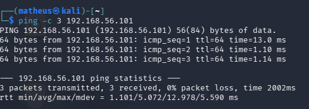
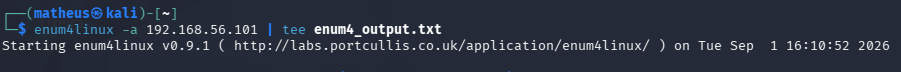
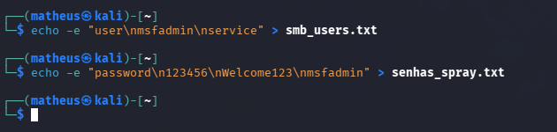
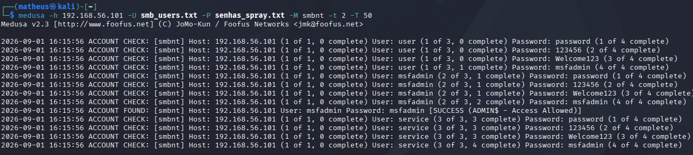
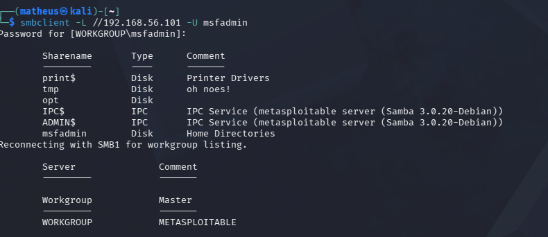

# Laboratório de Ataque em Cadeia com Medusa

<p align="center">
  
  
  
  
  
</p>

<p align="center">
  Laboratório educacional de cibersegurança com Kali Linux, Medusa e SMBClient, voltado ao estudo de enumeração SMB, password spraying e ataque em cadeia em ambiente controlado.
</p>

---

## Sobre o Projeto

Este projeto apresenta um laboratório prático de **ataque em cadeia** utilizando **Kali Linux**, **Medusa** e **SMBClient**.

O laboratório foi realizado em ambiente controlado e autorizado, com foco no estudo de enumeração SMB, uso de wordlists, execução de password spraying com Medusa, acesso ao serviço SMB e documentação das evidências.

---

## Ferramentas Utilizadas

| Ferramenta | Finalidade |
|---|---|
| Kali Linux | Ambiente utilizado para execução do laboratório |
| Medusa | Ferramenta utilizada para o teste de força bruta/password spraying |
| SMBClient | Ferramenta utilizada para acesso ao serviço SMB |
| Ping | Verificação de conectividade com o alvo |
| Wordlists | Listas de usuários e senhas utilizadas no teste |
| Ambiente controlado | Execução segura e autorizada do laboratório |

---

## Estrutura do Projeto

```text
laboratorio-ataque-em-cadeia-medusa/
│
├── evidências/
│   ├── Acesso com Smbclient.png
│   ├── Execução do Medusa.png
│   ├── Lista de Usuarios e sENHAS.png
│   ├── Reconhecimento com smb.png
│   └── Teste de conectividade.png
│
├── vídeo/
│
├── listas de palavras/
│   ├── password.txt
│   └── users.txt
│
├── Relatório Técnico-Ataque em Cadeia Enumeração SMB e Password Spraying.pdf
└── README.md
```

---

## Evidências

### Teste de Conectividade

Evidência da verificação de comunicação com o ambiente de teste.



---

### Reconhecimento com SMB

Evidência da etapa de reconhecimento do serviço SMB.



---

### Lista de Usuários e Senhas

Evidência das listas de usuários e senhas utilizadas durante o laboratório.



---

### Execução do Medusa

Evidência da execução da ferramenta Medusa durante o teste.



---

### Acesso com SMBClient

Evidência do acesso ao serviço utilizando SMBClient após a identificação de credenciais válidas.



## Listas de Palavras Utilizadas

As listas utilizadas no laboratório estão na pasta:

```text
listas de palavras/
```

Arquivos:

```text
listas de palavras/users.txt
listas de palavras/password.txt
```

Essas listas foram utilizadas apenas para fins educacionais dentro de um ambiente controlado.

---

## Vídeo Demonstrativo

O vídeo demonstrativo do laboratório está disponível no YouTube:

[Assistir vídeo demonstrativo](https://youtu.be/oWSAro5NgTE)

O vídeo apresenta a simulação do laboratório de ataque em cadeia, mostrando as etapas realizadas em ambiente controlado e autorizado.

---

## Relatório Técnico

O relatório completo do laboratório está disponível no arquivo abaixo:

[Ver relatório técnico](<RelatórioTécnico-Ataque em Cadeia Enumeração SMB e Password Spraying.pdf>)

O relatório contém mais detalhes sobre o ambiente, metodologia, execução, evidências, resultado e conclusão do laboratório.

---

## Resumo do Laboratório

O laboratório foi organizado nas seguintes etapas:

1. Teste de conectividade com o ambiente.
2. Reconhecimento do serviço SMB.
3. Criação das listas de usuários e senhas.
4. Execução do teste com Medusa.
5. Realização da técnica de password spraying.
6. Identificação de credenciais válidas.
7. Acesso ao serviço SMB com SMBClient.
8. Organização das evidências e relatório técnico.

---

## Aviso de Uso Ético

Este projeto foi desenvolvido exclusivamente para fins educacionais.

Os testes foram realizados em ambiente controlado e autorizado. O uso de ferramentas como Medusa e SMBClient em sistemas, redes, aplicações ou serviços de terceiros sem permissão pode ser ilegal.

O objetivo deste laboratório é estudar segurança de senhas, serviços SMB, autenticação e boas práticas de proteção.

---

## Recomendações de Segurança

Algumas práticas importantes para reduzir riscos relacionados a ataques de força bruta, password spraying e exposição de serviços SMB:

- utilizar senhas fortes;
- evitar senhas padrão;
- aplicar autenticação multifator;
- limitar tentativas de login;
- bloquear acessos suspeitos;
- monitorar logs de autenticação;
- restringir acesso a serviços SMB;
- desabilitar compartilhamentos desnecessários;
- aplicar políticas de senha;
- manter sistemas atualizados.

---

## Autor

Projeto desenvolvido por **Matheus Soares** para fins de estudo e prática em cibersegurança, com foco em Kali Linux, Medusa, SMBClient, enumeração SMB, password spraying, segurança de senhas e documentação de evidências.

---

## Uso Educacional

Este laboratório possui finalidade exclusivamente educacional e foi desenvolvido para estudo de cibersegurança em ambiente controlado e autorizado.
